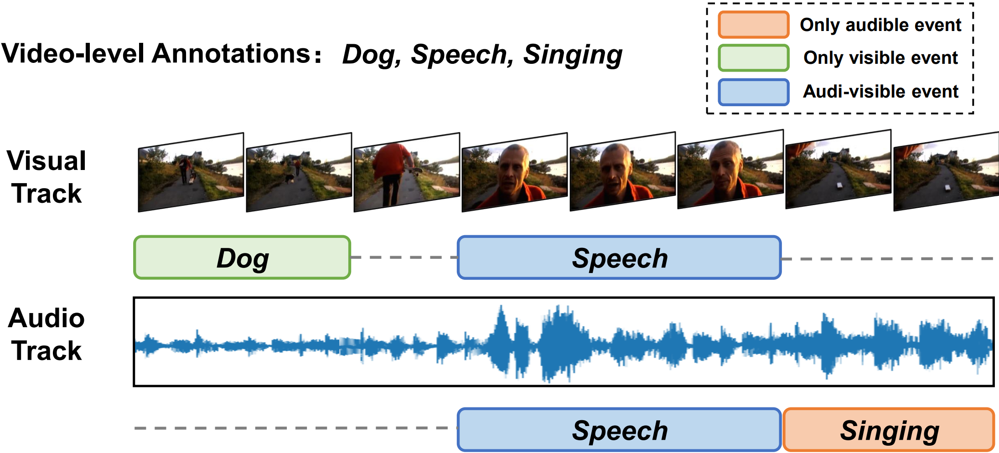
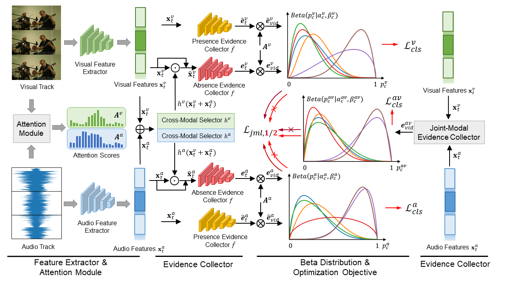

## Collecting Cross-Modal Presence-Absence Evidence for Weakly-Supervised Audio-Visual Event Perception

[Junyu Gao](https://scholar.google.com/citations?user=y1nOY24AAAAJ&hl=zh-CN&oi=ao), [Mengyuan Chen](), [Changsheng Xu](https://scholar.google.com/citations?user=hI9NRDkAAAAJ&hl=zh-CN&oi=ao)

Code for CVPR 2023 paper [Collecting Cross-Modal Presence-Absence Evidence for Weakly-Supervised Audio-Visual Event Perception]()


## Paper Overview


### Weakly-supervised Audio-Visual Video Parsing



### Overview of CMPAE



## Get Started

### Dependencies
Here we list our used requirements and dependencies.
 - GPU: GeForce RTX 3090
 - Python: 3.8.6
 - PyTorch: 1.12.1
 - Other: Pandas, Openpyxl, Wandb (optional)


### Prepare data

1. Please download the preprocessed audio and visual features from https://github.com/YapengTian/AVVP-ECCV20.
2. Put the downloaded features into ```data/feats/```, and put the annotation files into ```data/annotations/```.


### Train your own models
Run ```./train.sh```.


### Test the pre-trained model

Download the checkpoint file from [Google Drive](https://drive.google.com/file/d/1WD63s4G_w9C7V9XIYK2AF5yYyoe2CNXy/view?usp=sharing), and put it into ```save/pretrained/```.
Then run ```./test.sh```.


## Citation
If you find the code useful in your research, please consider citing it:

    @inproceedings{junyu2023CVPR_CMPAE,
      author = {Gao, Junyu and Chen, Mengyuan and Xu, Changsheng},
      title = {Collecting Cross-Modal Presence-Absence Evidence for Weakly-Supervised Audio-Visual Event Perception},
      booktitle = {IEEE/CVF Conference on Computer Vision and Pattern Recognition (CVPR)},
      year = {2023}
    }

## License

See [MIT License](/LICENSE)

## Acknowledgement

This repo contains modified codes from:
 - [JoMoLD](https://github.com/MCG-NJU/JoMoLD): for implementation of the backbone [JoMoLD (ECCV-2022)](https://arxiv.org/abs/2204.11573).

We sincerely thank the owners of the great repos!

